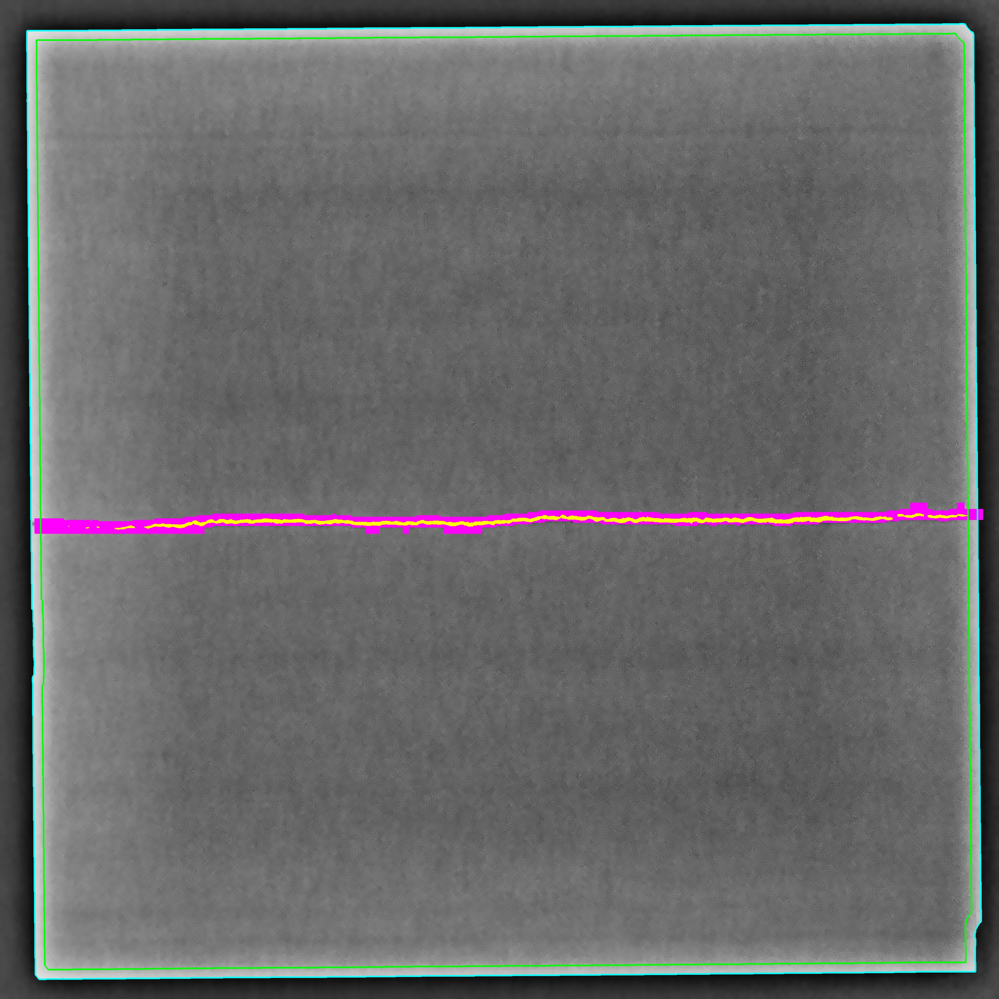
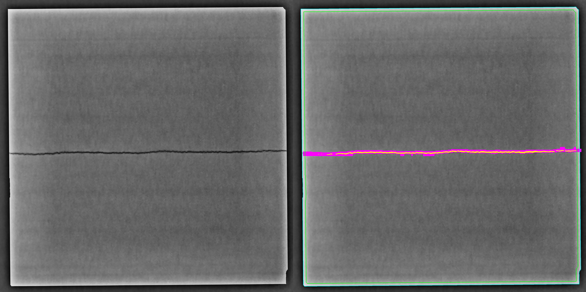
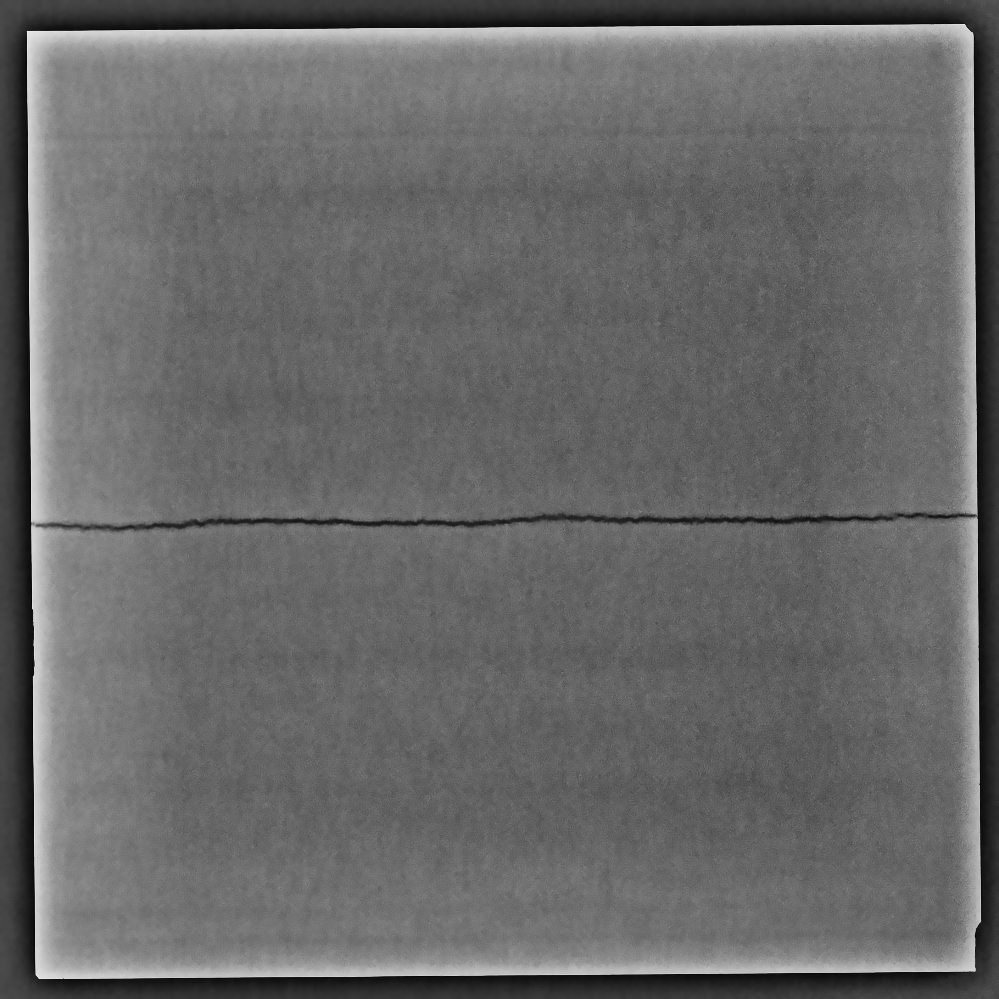

# Crack and Hole Segmentation Detection on SEM Images

This project provides automated detection and segmentation of cracks and holes in Scanning Electron Microscope (SEM) images using a hybrid approach combining computer vision techniques and YOLOv8 deep learning model.

## Overview

The system processes high-resolution SEM images (3176×3176, 16-bit depth) through a two-stage pipeline:
1. **Preprocessing**: Enhances image quality and contrast for better detection
2. **Detection**: Combines computer vision (for holes/dark spots) and YOLOv8 (for crack segmentation)

## Features

- **Dual Detection Methods**:
  - Computer Vision: Detects dark spots and anomalies (holes)
  - YOLOv8: Segments and detects cracks
- **Advanced Preprocessing**: Histogram stretching, CLAHE, denoising, and sharpening
- **Flexible Input**: Supports single files, folders, or glob patterns
- **Automatic Border Detection**: Intelligently identifies and excludes image boundaries
- **Batch Processing**: Process multiple images efficiently

## Installation

### Requirements

- **Python 3.11.9** (tested and guaranteed to work with this version)

### Setup
```bash
# Clone the repository
git clone https://github.com/theaksaa/sem-cracks-holes-segmentation-detection.git
cd sem-cracks-holes-segmentation-detection

# Install dependencies
pip install -r requirements.txt
```

**requirements.txt:**
```
numpy==1.26.4
Pillow==12.0.0
opencv-python==4.10.0.84
ultralytics==8.3.221
```

## Project Structure
```
.
├── detectors/
│   ├── cv_detector.py          # Computer vision detection module
│   └── yolo_detector.py        # YOLO detection module
├── preprocessing/
│   └── image_preprocessor.py   # Preprocessing utilities
├── processing/
│   └── image_processor.py      # Image processing utilities
├── utils/
│   └── file_utils.py           # File handling utilities
├── input/                      # Input SEM images
│   ├── Foil_1.tif
│   ├── Foil_2.tif
│   ├── Foil_3.tif
│   ├── Foil_4.tif
│   ├── Foil_5.tif
│   └── Foil_6.tif
├── models/                     # Trained model weights
│   └── best.pt
├── output/                     # Detection results
├── docs/                       # Documentation and examples
│   ├── Foil_3.jpg
│   ├── Foil_3_comparison.jpg
│   └── Foil_3_preprocessed.jpg
├── main.py                     # Combined preprocessing + prediction
├── predict.py                  # Detection and segmentation inference
├── preprocessing.py            # Image preprocessing script
├── train.py                    # YOLOv8 model training
└── requirements.txt            # Python dependencies
```

## Visual Examples

### Detection Results



*Example of crack and hole detection on SEM image Foil_3.*

#### Color Code Legend:
- **Magenta**: YOLO detection (deep learning-based crack segmentation)
- **Green**: Computer vision detection (threshold-based hole/dark spot detection)
- **Yellow**: Overlapping detections (both CV and YOLO agree on defect location)
- **Blue box**: Automatically detected image boundary using edge detection
- **Green box**: Border offset region (inner boundary that excludes edge artifacts from detection area)

The blue box represents the actual detected rectangular boundary on the microscopic image using edge detection. The green box shows the offset border (moved inward by `--border-offset` pixels). This approach ensures that only defects inside the material are detected, preventing false positives from artifacts at the image edges.

### Preprocessing vs Detection Comparison



*Side-by-side comparison showing the preprocessing and detection stages.*
- **Left**: Preprocessed SEM image with enhanced contrast, denoising, and sharpening applied
- **Right**: Final detection results with segmented cracks (magenta/yellow) and holes (green/yellow)

### Preprocessed Image



*SEM image after complete preprocessing pipeline (histogram stretching, CLAHE, denoising, and sharpening). This enhanced image serves as input to the detection algorithms.*

## Usage

### Quick Start (Recommended)

For the best results with default optimized settings:
```bash
# 1. Preprocess SEM images
python preprocessing.py --input input/*.tif --out input --clahe --denoise --denoise-strength 20 --sharpen

# 2. Run detection
python predict.py --sensitivity custom --auto-borders --border-offset 30 --input input/*.jpg --output output/ --method both --model-path models/best.pt --show-borders

# Or use the combined pipeline
python main.py
```

### Individual Components

#### 1. Preprocessing (`preprocessing.py`)

Prepares high-resolution 16-bit SEM images for optimal detection performance.
```bash
python preprocessing.py --input <input> --out <output> [OPTIONS]
```

**Required Arguments:**
- `--input`: Input file, folder, or glob pattern (e.g., `input/*.tif`)
- `--out`: Output file or directory (not required with `--nosave`)

**Options:**
- `--lower <0-100>`: Lower percentile for histogram stretch (default: 0)
- `--upper <0-100>`: Upper percentile for histogram stretch (default: 100)
- `--clahe`: Apply CLAHE for local contrast enhancement
- `--clahe-clip <float>`: CLAHE clip limit (default: 2.0)
- `--clahe-tile <int>`: CLAHE tile size (default: 8)
- `--denoise`: Apply denoising filter
- `--denoise-strength <int>`: Denoising strength (default: 10, recommended: 20)
- `--sharpen`: Apply sharpening to enhance crack visibility
- `--sharpen-amount <float>`: Sharpening intensity (default: 1.5)
- `--quality <1-100>`: JPEG output quality (default: 95)
- `--nosave`: Preview only without saving

**Processing Steps:**
1. Histogram stretching (contrast normalization)
2. CLAHE (Contrast Limited Adaptive Histogram Equalization)
3. Denoising (noise reduction)
4. Sharpening (edge enhancement)

#### 2. Detection (`predict.py`)

Performs crack and hole detection using CV and/or YOLO methods.
```bash
python predict.py --input <input> --output <output> [OPTIONS]
```

**Required Arguments:**
- `--input`: Input file, folder, or glob pattern
- `--output`: Output file or directory

**Method Selection:**
- `--method <cv|yolo|both>`: Detection method (default: both)
  - `cv`: Computer vision only (holes/dark spots)
  - `yolo`: Deep learning only (cracks)
  - `both`: Combined detection (recommended)

**YOLO Parameters:**
- `--model-path <path>`: Path to YOLO weights (default: `runs/segment/Cracks_Segmentation_yolov8/weights/best.pt`)
- `--conf <float>`: Confidence threshold (default: 0.25)
- `--iou <float>`: IoU threshold for NMS (default: 0.7)

**Computer Vision Parameters:**
- `--sensitivity <low|medium|high|custom|auto>`: Detection sensitivity (default: medium)
- `--auto-borders`: Automatically detect rectangular boundaries
- `--border-offset <int>`: Additional pixels to move border inward (default: 0, recommended: 30)
- `--border-left/right/top/bottom <int>`: Manual border sizes (default: 50)
- `--show-borders`: Draw green border lines on output

**Options:**
- `--nosave`: Preview only without saving

#### 3. Training (`train.py`)

Train YOLOv8 model on custom crack dataset.
```bash
python train.py
```

**Output:**
- Model weights saved to: `runs/segment/Cracks_Segmentation_yolov8/weights/best.pt`

#### 4. Combined Pipeline (`main.py`)

Runs preprocessing and prediction with optimized settings in one command.
```bash
python main.py
```

## Dataset

This project uses the crack segmentation dataset from:
- **Dataset**: [Download from Google Drive](https://drive.google.com/file/d/1iQRpRfxv_5VB2OqY_5ij6jX6MbsHFLvk/view)

## How It Works

### Preprocessing Pipeline
1. **Histogram Stretching**: Normalizes pixel intensity distribution
2. **CLAHE**: Enhances local contrast while preventing over-amplification
3. **Denoising**: Reduces image noise while preserving edges
4. **Sharpening**: Enhances crack edges for better detection

### Detection Pipeline
1. **Computer Vision Method**:
   - Identifies dark spots and anomalies using threshold-based techniques
   - Detects holes and voids in the material
   
2. **YOLOv8 Method**:
   - Deep learning-based crack segmentation
   - Provides precise crack boundaries and masks

3. **Hybrid Approach**:
   - Combines both methods for comprehensive defect detection
   - Handles both linear cracks and circular holes

## Example Workflow
```bash
# Step 1: Preprocess raw SEM images
python preprocessing.py \
  --input input/*.tif \
  --out input \
  --clahe \
  --denoise --denoise-strength 20 \
  --sharpen

# Step 2: Run combined detection
python predict.py \
  --sensitivity custom \
  --auto-borders \
  --border-offset 30 \
  --input input/*.jpg \
  --output output/ \
  --method both \
  --model-path models/best.pt \
  --show-borders
```

## Tips for Best Results

- **For noisy images**: Increase `--denoise-strength` to 20-30
- **For faint cracks**: Use `--sharpen` and increase `--sharpen-amount`
- **For images with borders**: Use `--auto-borders` with `--border-offset 30`
- **For precision**: Adjust `--conf` threshold (lower = more detections, higher = fewer false positives)

## Authors

- **Uros Aksentijevic**
- **Djordje Todorovic**

## Acknowledgments

- YOLOv8 by Ultralytics
- Crack segmentation dataset contributors